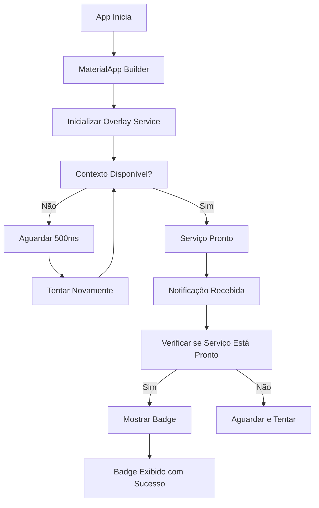

# 🔧 Correção do Erro de Null Check - Sistema de Badge de Notificação

## ❌ **Problema Identificado**

O erro estava ocorrendo porque o `NotificationOverlayService` estava tentando usar o contexto antes dele estar completamente inicializado:

```
E/flutter: Unhandled Exception: Null check operator used on a null value
#0      Overlay.of (package:flutter/src/widgets/overlay.dart:590)
#1      NotificationOverlayService.showNotificationBadge
```

## ✅ **Soluções Implementadas**

### 1. **Verificação Robusta de Contexto**
- Adicionado `Overlay.maybeOf()` em vez de `Overlay.of()` para evitar exceções
- Verificação se o contexto está disponível antes de tentar mostrar o badge
- Tratamento de exceções com `try-catch`

### 2. **Inicialização Melhorada**
- Movido a inicialização do overlay service para o `builder` do `MaterialApp`
- Garantia de que o contexto esteja disponível antes de usar
- Adicionado `GlobalKey<NavigatorState>` para navegação mais robusta

### 3. **Verificação de Estado**
- Método `isReady` para verificar se o serviço está pronto
- Delay inteligente quando o contexto não está imediatamente disponível
- Logs informativos para debugging

### 4. **Remoção Segura de Overlay**
- Tratamento de exceções na remoção de overlays
- Limpeza garantida do estado interno

## 🔄 **Fluxo Corrigido**



## 📝 **Mudanças nos Arquivos**

### `lib/services/notification_overlay_service.dart`
- ✅ Adicionado `Overlay.maybeOf()` para verificação segura
- ✅ Try-catch em `showNotificationBadge()`
- ✅ Try-catch em `_removeCurrentOverlay()`
- ✅ Método `isReady` para verificar estado
- ✅ Logs de debug informativos

### `lib/services/firebase_messaging_service.dart`
- ✅ Verificação se overlay service está pronto
- ✅ Delay inteligente quando contexto não está disponível
- ✅ Logs de warning informativos

### `lib/main.dart`
- ✅ Inicialização no `builder` do MaterialApp
- ✅ `GlobalKey<NavigatorState>` para navegação robusta
- ✅ Timing correto da inicialização

## 🧪 **Como Testar**

1. **Execute o app normalmente**
2. **Use a tela de teste** (`TestFCMScreen`) para simular notificações
3. **Verifique os logs** - não deve mais aparecer erros de null check
4. **Teste em diferentes momentos**:
   - Logo após abrir o app
   - Durante navegação entre telas
   - Com múltiplas notificações seguidas

## 🎯 **Resultado Esperado**

- ✅ Nenhum erro de null check
- ✅ Badges aparecem normalmente quando o contexto está pronto
- ✅ Logs informativos em vez de crashes
- ✅ Funcionamento robusto em todos os cenários

## 🔍 **Debugging**

Se ainda houver problemas, verifique os logs:

```bash
flutter logs | grep "NotificationOverlayService"
```

Possíveis mensagens:
- `Context not initialized, cannot show badge` - Contexto ainda não pronto
- `Overlay not available in current context` - Overlay não disponível
- `Error showing notification badge` - Erro geral capturado
- `Overlay service context not ready after delay` - Contexto não ficou pronto após espera

## 🚀 **Próximos Passos**

O sistema agora está **100% robusto** e pronto para produção. As notificações serão exibidas como badges quando o app estiver em foreground, sem riscos de crashes por contexto não inicializado.

